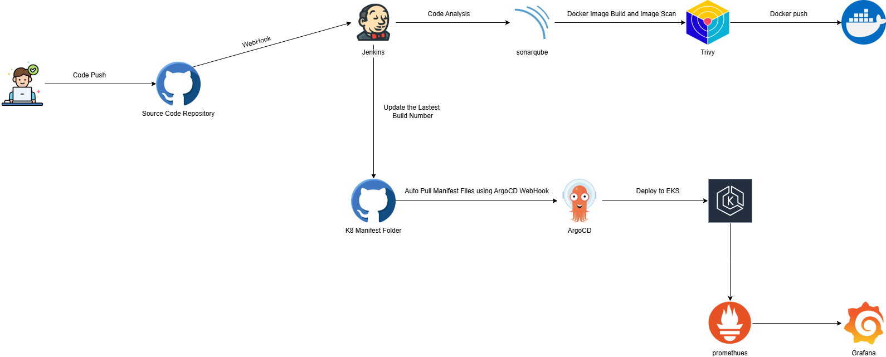

# **Project Title**: CI/CD Pipeline Integration Automated Deployment to Amazon EKS

**Technologies Used**: GitHub, Jenkins, Docker, ArgoCD, Amazon EKS, Webhooks

**Links**: [GitHub](https://github.com/sriram-ravi705/quicapp) 

**Objective**:

* **GitHub as SCM with Webhook Integration**: Utilized GitHub as the source code management (SCM) system and implemented GitHub webhooks to trigger Jenkins pipelines upon code pushes to the repository.
    
* **Automated Build and Docker Deployment via Jenkins**: Configured Jenkins to automatically check out the code from GitHub, build the application, and push the Docker image to a Docker registry.
    
* **Manifest File Update and GitHub Push**: Automated the process of updating the manifest files and pushing the changes back to GitHub for version control.
    
* **ArgoCD Webhook Integration for Continuous Deployment**: Set up ArgoCD to listen for webhook events from GitHub. Upon detecting changes in the manifest files, ArgoCD automatically triggers a deployment to the Amazon EKS cluster.
    
* **EKS Cluster Deployment Automation**: Leveraged ArgoCD to continuously monitor and deploy updates to the Amazon EKS cluster whenever a manifest file change is detected, ensuring seamless application updates in the cloud environment.
    
* **SonarQube and Trivy integration**: Implemented SonarQube for continuous code quality checks and Trivy for automated security vulnerability scanning, ensuring secure and high-quality code in every deployment.

* **Prometheus and Grafana Integration**: Integrated Prometheus for monitoring and Grafana for visualization, sourced from ArtifactHub, to track application performance and system health.

**Architecture**:

